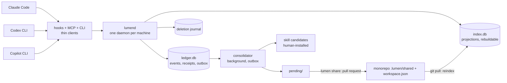

# Lumen v5: durable memory across agents and repositories (plan)

**Status: in implementation since 2026-09-11; frozen as the contract, amended 2026-09-12.** Deviations from this plan were recorded in an architecture audit whose owner decisions appear as the amendments below. Supersedes [Lumen-v4.md](Lumen-v4.md). Owner: Woody.

**Amendments, 2026-09-12** (owner decisions on the audit's items 4, 5, 7, 8, 9; sections marked *amended*):
1. Data model and read path adopt the built field names and integer time encoding; `as_of` is an accepted alias of `at` in the recall payload (ADR 0001).
2. Shared event files are canonical JSON in a Markdown fence, not YAML front matter (ADR 0002).
3. Python only, decided 2026-09-12: the Go launcher is removed and ported to `lumen.hook`, a stdlib-only module launched as `python -I -m lumen.hook`. No-workspace exit measured at cold 29.9 ms, warm p50 25.1 ms, warm p95 26.4 ms against a bare-interpreter baseline of 12.9 ms warm p50 (Windows x64, Python 3.14, `docs/validation/python-hook-2026-09-12.json`); the 10 ms aspiration is withdrawn, R-14's 300 ms SessionStart p95 is the gate (ADR 0004 superseded).
4. The per-developer store layout matches disk; the episode export was owed and is built (2026-09-13); `skill-candidates/` waits for Phase 6.
5. The CLI list carries the twelve built commands; `import`, `feedback`, `skills` and `pending` stay owed in their phases.

**Amendments, 2026-09-13** (audit items 1, 2, 3, 10, 14, 15 built; sections marked *amended 2026-09-13*):
6. `.lumen/relations.yaml` is read by a strict single-line subset parser (no YAML dependency), per-relation `dimensions` widen undeclared dimensions at match time, projection version 3 (ADR 0007). The built-in defaults declare the four relations over all three dimensions.
7. `.lumen/config.toml` is team policy read with `tomllib`: pinned version, caps that only lower, trust flags that must stay false, share limits; `lumen init` writes both team files and `.lumen/.gitignore` ignores only `checkout.json` (ADR 0007).
8. Session start delivers the hint plus the catalog slice under a 2,000-token estimate; every grant carries `user` and `session`, and `session:<id>` working state is widened per call (ADR 0007).
9. CI: `.github/workflows/offline-tests.yml` (three-OS matrix), written 2026-09-13 and not yet executed.
10. `lumen share` action `branch` builds the branch-and-batch half of the pull-request flow locally (one branch per repo batch through a temporary worktree, capped by `share.batch_limit`, recorded for `lumen pending`); push, pull request and forge review evidence stay pending on the forge, and `audit --ci` accepts that only when `share.pull_request = "pending"` is committed (ADR 0008).
11. `lumen import` reads Claude Code auto memory, Codex memory files and Hermes `MEMORY.md` as files into `agent-observed` `imported_note` assertions with an `import` citation kind that carries the file hash and the lineage the file records; never shared, owner-only, bulk behind `--all` (ADR 0001 section). `lumen pending` is built with the share branches.
12. Phase 4 offline (ADR 0009): the consolidator runs over the episode outbox with a deterministic, vocabulary-bound extractor and no model; the supersession judge is disabled and every competing single-valued fact becomes an explicit `dispute`; episode-derived facts are `agent-observed` (the capture channel is the agent's) or `tool-derived` from captured tool outputs; summaries record their dependencies and go stale on revision or purge. Judge-enabled mode and a model extractor stay pending on inference.
13. Phase 5 offline: recall indexes identifier variants (case, camel, snake, path splits), expands source-backed `alias_of` aliases once and refuses ambiguous ones, joins one hop along indexed relation edges, searches evidence citation text under its assertion, demotes span-overlapping results, and widens scope from the repo through the monorepo and one dependency hop to user facts with nearer results ranked first; index schema 3. `tools/measure-scale.py` records direct-core, four-client IPC and session-start distributions (`docs/validation/scale-2026-09-13.json`). No embedding model exists; the textual planner and the full-evidence router stay disabled pending inference.
14. Phase 6 offline (ADR 0010): attack fixtures for forged user statements, tool-result laundering, poisoned shares, false citations, malicious tracked comments and multistep promotion run in `bench --suite poison`; the secret detector covers twelve token shapes; skill candidates are distilled after three recurrences into `~/.lumen/skill-candidates/` and never installed; `lumen feedback` records owner verdicts as audit findings; `lumen pending` reports the review-fatigue counts it can compute offline. The decay study and the review-time metrics need the pilot and the forge.
Home: `harness-tools/lumen`. Package `lumen-memory`, CLI `lumen`, MCP server `lumen`. Check the
name against GitHub, PyPI and npm before Phase 1; "Lumen" collides with a telecom and a PHP
framework, so the package name may need a qualifier.

The product release ends in one command:

```
lumen bench --suite release --manifest evals/release-1.json --clients evals/clients.lock.json --max-cost-usd <cap>
```

Exit 0 requires every case in the Release 1 manifest to pass. A missing client, a skipped required
case, or a missing pilot report fails the run. A mock adapter never establishes support. Release 2
runs the same command with the comparison manifest.

## 1. What changed from Lumen v4, and why

**Hard constraint: Lumen cannot use embeddings.** This applies to development, product operation,
imports, recovery and evaluation. It is not a default that can be enabled later.

V5 retains v4's event model, durability, identity, sharing, temporal semantics, approval controls,
three-client support and two-release structure. It replaces the optional vector retrieval path
with explicitly non-embedding retrieval and adapts its dependencies, acceptance cases and baselines.

| V4 component | V5 treatment |
|---|---|
| Optional dense retrieval and embedding providers | Removed; no embedding generation, API calls, stored feature vectors or semantic-nearest-neighbour search |
| sqlite-vec and USearch | Removed from dependencies, configuration and supported fallbacks |
| bge-m3, ONNX embedding runtime and associated Windows runtime requirement | Removed; no model download for local indexing or retrieval |
| BM25, exact identifiers and entity/repository relationships | Primary retrieval paths, fused by ranks with evidence-backed alias expansion |
| Optional reranking | Deterministic text/evidence ranking first; no embedding-backed or opaque reranker |
| Model-assisted planning and consolidation | Still optional text-in/text-out operations under existing authorization, privacy and cost policy; never a route to hidden embeddings |
| Dense baseline and embedding-based competitors | Not executed, including hosted services that use embeddings; use only verified compliant configurations |
| Health, performance, manifests and fixtures | Updated for lexical/relational retrieval and an explicit no-embeddings contract, R-18 |

The restriction does not itself ban the optional text-generation models already in v4. Those
remain unnecessary for offline core operation and need their existing approval/budget. Their
allowed use is textual extraction, judgment or query reformulation, not an embedding API,
vector store, semantic-search endpoint or model-generated numerical retrieval representation.

No external service may hide the prohibited work. Unknown provider internals for retrieval
capabilities are insufficient to call them compliant: exclude such integrations. Ordinary text
generation is a separate capability and does not authorize attaching a provider-managed memory
or retrieval service.

Historical research citations below remain background evidence, not permission to install the
systems they describe. The implementation pins its own compliant dependencies and configurations.

### The goal, stated

1. **Release 1: durable handoff.** A decision recorded in one host is used correctly in a second,
   corrected in a third, and every later session respects the correction, across the repos of one
   monorepo, with a second developer receiving reviewed knowledge and nothing private.
2. **Release 2: the reproducible comparison.** Eligible pinned incumbents through one component
   harness, one answer model, one calibrated judge, permitted raw outputs public. A reproducible
   comparison on forgetting and monorepo tasks. Any claim of leadership needs its own evidence.

Release 1 is the product and requires no benchmark win. Release 2 is the credibility asset. Phase 0
builds the fixture and harness skeleton. A pinned BM25 reference is an independent calibration
experiment; matching one score cannot prove the whole harness. Product integrity and reference
replication have separate outcomes. Inference is costed and requires an approved cap.

## 2. What "done" means

**Definition of done for Release 1.** On a clean clone on this machine, with the three clients
installed at the versions in `evals/clients.lock.json`, the release command exits 0 with:

- Six ordered handoffs between Claude Code, Codex CLI and Copilot CLI: a fact remembered in host
  A is recalled with its citation in host B, corrected in B, and the correction is what A sees
  after a restart. The session-start fallback works with the hook disabled. A host that runs
  another host's hooks captures once.
- On the semantics fixture in all three topologies (single git repo with logical projects, nested
  clones, submodules): a fact learned in the producer is recalled from the consumer with both
  citations; a moved repo keeps its id and breaks zero citations; two simulated developer homes
  exchange reviewed facts with zero private captures crossing; two shared facts that supersede
  the same predecessor with overlapping affected regions come back as `disputed`, never as a silent winner; disjoint changes coexist.
- Every requirement R-01 to R-18 in [§7](#7-requirements) has a named test that passed, with the
  installed-client cases run on installed clients.
- SessionStart p95 under 300 ms on Windows inside the fixture; recall p95 under 1 s at 100k
  records on the declared hardware.
- Offline capture, revisions, export, restore and erasure pass without model credentials.
- Deterministic fixture/scorer checks pass. BM25 reference replication is reported
  separately; unexplained divergence blocks a faithful-replication claim, not product acceptance.
- R-17 passes in the declared mode: qualified automatic retirement or tested disabled fallback.
- R-18 proves the package, configured adapters and all executed suites use no embeddings.
- A pilot report is committed under `docs/validation/pilot-<date>.md` carrying the R-16 metrics.

**Definition of done for Release 2** is the [Release 2 gate](#release-2-the-completed-comparison).

## 3. What the record says, and what follows

Each row cites the vault page that holds the evidence. Rows 1 to 23 are carried from plan 1; rows
24 to 28 are the failures the Lumen reviews added answers for.

| # | Documented failure | Evidence | Design answer |
|---|---|---|---|
| 1 | Memory loses to reading the history until the history is long, and the crossover depends on the answer model | Full context 72.90 vs Mem0 66.88 on LoCoMo; full context 60.2% on LongMemEval_s with gpt-4o ([head-to-head][cmp], [Mem0 limitations][mem0lim]) | A **long-context router** with the crossover measured per answer model on the harness, never a fixed conversation count |
| 2 | Summaries lose the detail that answers the question | MemPalace summary mode drops R@5 by 12.4 points; memsearch: a skill written from a summary "tends to be plausible but wrong" ([MemPalace][mempal], [memsearch limitations][mslim]) | **Verbatim episodes are the source of truth.** Every derived item cites the episode it came from. |
| 3 | Retirement decided over the whole store retires true facts and misses real contradictions | Graphiti #1728: 1,616 of ~3,950 facts retired, three of four audited wrongly; #1666: contradiction detection right in 7/15, 14/15 once a reasoning field precedes the verdict; "no notion of cardinality today" ([Zep and Graphiti][graphiti]) | **Scoped supersession.** Candidates share subject, relation and applicability. Relations declare `single` or `multi`. The judge sees context and reasons before it answers, and its precision is a requirement (R-17). Low confidence is `disputed`. |
| 4 | Time collapses at scale | BEAM temporal 61.8 to 16.3 from 1M to 10M in Mem0's tables ([BEAM][beam]) | **Bi-temporal facts** with validity derived as a set of intervals, since Graphiti #1865 merges a recurrence into its closed predecessor |
| 5 | Multi-fact questions collapse | ConvoMem: Mem0 61% to 38% to 25% at 1, 3, 6 evidence items ([Mem0 limitations][mem0lim]) | A **query planner** that decomposes, retrieves per part, merges before answering |
| 6 | A semantic threshold hides exact matches | Mem0 gates on semantic score before fusion ([Mem0 storage][mem0store]) | **Rank fusion over lexical, exact-identifier and relational candidates, with no semantic gate** |
| 7 | Things break silently | memsearch: capture, indexing and reranking all fail "silently"; Graphiti's MCP server lost 137 of 218 acknowledged episodes with its health endpoint green ([memsearch limitations][mslim], [Zep and Graphiti][graphiti]) | **Loud failure.** Every recall reports which signals ran. `lumen doctor` exits non-zero on any degraded required path. Disabled optional paths are healthy. |
| 8 | Unverified memory becomes confident misinformation | GitHub's cited, re-verified memory lifted merge rate 83% to 90% (p < 0.00001); static context files did not help ([product standard][prodstd]) | **Citations checked at read time.** A changed hash marks the fact `stale` and triggers revalidation, never automatic falsification. |
| 9 | Memory is an injection channel | OWASP ASI06; Hermes audit 4 Critical / 9 High ([safety][safety], [Hermes security][hermsec]) | **Origin tiers and quarantine.** External content never reaches the resident block or the team without a recorded approval, and approval never changes its origin. Summarisation never launders a tool-derived origin into a user one. |
| 10 | Rewriting the prompt mid-session breaks the prefix cache | Hermes freezes its snapshot for the cache ([Hermes memory][hermmem]) | **The resident block is frozen per session.** Recall packets are live per call, so subsequent service reads respect corrections/erasures; already-delivered context remains outside that guarantee until refreshed or the session restarts. |
| 11 | Always-loaded memory hits host caps | Claude Code caps hook output at 10,000 characters; Codex spills `additionalContext` to disk above ~2,500 tokens; auto memory loads 200 lines first ([host integration points][hosts]) | **Resident block plus catalog slice capped at 2,000 tokens** or the host's smaller verified limit. An over-cap write returns an error asking for consolidation. |
| 12 | Agents do not call memory tools | 58% of CodeCompass trials with graph access made zero tool calls; Graft: "one well-named command with flags is selected more reliably than three" ([Graft][graft]) | **Four MCP tools**, a one-line session-start hint that memory exists, and invocation rate measured in the pilot |
| 13 | Learned procedures are the dangerous layer | CoALA: procedural writes are "significantly riskier"; memsearch: "the machine proposes, you dispose" ([CoALA][coala], [memsearch layers][mslayers]) | **Skill candidates need three recurrences, execution evidence, and a human install.** |
| 14 | Two writers corrupt one store | Hermes: two processes sharing a home "compound each other's entries"; memsearch #631 ([Hermes memory][hermmem], [memsearch limitations][mslim]) | **One writer daemon per machine; shared events are append-only files with unique ids** |
| 15 | Hook startup eats the budget | memsearch #632: SessionStart spawned the CLI five times, ~3.2 s of a 10 s budget ([memsearch limitations][mslim]) | Hooks are thin clients to a warm daemon. SessionStart p95 under 300 ms is a gate. |
| 16 | Hooks are not reliable delivery | Codex `SessionStart` can silently fail to fire; Claude Code's `UserPromptSubmit` discards context after 30 s ([Codex extensibility][codex], [Claude Code hooks][cchooks]) | **A fallback line in the instruction file**, tested by disabling the hook. Unknown delivery is not capture. |
| 17 | Hosts run each other's hooks | VS Code runs `~/.claude/settings.json` hooks; Copilot CLI runs a repo's `.claude/settings*.json` ([host integration points][hosts]) | **The thin client identifies the host from the payload and dedupes** by transcript and turn id |
| 18 | Windows is an afterthought | Milvus Lite has no Windows binaries; sqlite-vec ships x64 and no ARM64 wheel ([storage substrates][substrates]) | **Windows x64 first.** SQLite/FTS5 only; no vector extension or embedding runtime. CI on Windows, Linux, macOS. |
| 19 | A single-maintainer dependency stalls | sqlite-vec went quiet through most of 2025 ([storage substrates][substrates]) | **No vector dependency.** SQLite/FTS5, exact-identifier indexes and relation tables support all retrieval |
| 20 | Memory lies about where it came from | Mem0's legacy prompts tell the model to say facts came "from publicly available sources on internet" ([Mem0 limitations][mem0lim]) | `lumen why <id>` prints the full chain. Provenance is data, never prose. |
| 21 | Shared memory needs an owner and a staleness rule | Copilot Memory is repo-scoped, owners review and delete, unused facts expire after 28 days ([Copilot memory][cpmem]) | **Shared facts are reviewed by the owning repo's CODEOWNERS.** `lumen audit` lists shared facts unused and unverified for 90 days. Nothing is deleted on a timer. |
| 22 | Hosts resolve the project root differently | Codex walks up to the first `.git`; VS Code skips folders with `.git`; Claude Code never inherits hooks from a parent ([host integration points][hosts], [VS Code instructions][vsmcp]) | **Lumen owns repo identity** through a committed manifest; hooks install at user level |
| 23 | Catalogs rot when files move | Backstage: moving `catalog-info.yaml` without updating registration orphans the entity ([Backstage ingestion][bsingest]) | The catalog is generated on every machine and `lumen catalog check` fails CI on any drift between the manifest and disk |
| 24 | Stamping a shared fact on every recall dirties the tree | Plan 1's `last_verified` on shared files, caught in review of Lumen v1 | **Verification receipts live in the local ledger**, never in `.lumen/shared/` |
| 25 | A judge tested only on wrong answers can pass by rejecting everything | Lumen v1 review; the LoCoMo judge passes 62.81% of wrong answers, the opposite failure ([LoCoMo][locomo]) | **Judges are calibrated on planted right and planted wrong answers**; both rates gate the run |
| 26 | "Immutable forever" and "fully forgettable" cannot both be true of one payload | Lumen v1 §3; Copilot deletes on a timer, Graphiti never deletes | **Expiry, retraction and erasure are three operations** with three guarantees, and the erasure report names what it cannot reach |
| 27 | A store built for one model rots when the model changes | Nobody has measured decay ([evaluation and overfitting][evalover]) | **A decay track**: freeze the store, change the reader, repeat the tasks |
| 28 | A generated file committed by many machines is a merge-conflict magnet | Lumen v3 review; plan 1, v2 and v3 all committed `catalog.yaml` | **Only intent is committed.** The manifest is reviewed; the catalog is derived locally and checked, never committed. |

## 4. Design

### Principles

1. **Explicit before automatic.** `lumen remember` and `memory_remember` work before any hook exists.
2. **Verbatim first, derived second.** Anything the system writes traces back to a turn or a code span.
3. **Supersede narrowly.** A revision changes only the applicability and time region it names. Event history is preserved; only explicit erasure removes content.
4. **Zero model calls on the hot path.** Capture and indexing are deterministic. Model calls are background, batched, rate-limited, or inside an explicit recall.
5. **Events are the truth; state is a projection.** Shared events are files in git; private events are rows in the ledger. Every index, every "current" fact and every packet can be rebuilt from the events.
6. **Private by default, shared by review.** Knowledge reaches the team only through a pull request. Provider calls obey per-scope egress policy.
7. **Learned memory is advisory; guardrails are mechanical.** Memory never grants a permission.
8. **Fail loudly.** A degraded required signal is reported in the response and fails `lumen doctor`.
9. **Small surface.** Four tools, one CLI, one marker-fenced section in the monorepo root `AGENTS.md`.
10. **No embeddings anywhere in the workflow.** The constraint is schema-validated, dependency-checked and tested; no optional flag, fallback or evaluation baseline bypasses it.

### Layers

| Layer | Holds | Written by | Persistence rule | Lives | Reaches the model |
|---|---|---|---|---|---|
| **Episodes** | Captured user-visible turns; tool outputs truncated and hashed | Explicit capture or hooks, no model | Ledger events; the JSONL export is a projection. Ranking decays with age unless cited. Retention configurable. | Machine only | On `expand` |
| **Facts** | Subject, relation, value, applicability, citations, origin; validity, status and evidence list derived from events | `remember`, or the background consolidator | Retired by scoped supersession. Hard delete only through `purge`. | User facts in the local ledger; repo and monorepo facts in the monorepo after review | On `recall` |
| **Catalog** | One entry per repo: id, path, purpose, owners, dependencies, availability | `lumen catalog build`, from the manifest and the tree | Generated locally, never committed; checked against the manifest | Each machine | A slice at session start; the rest on `recall` |
| **Resident block** | The few user, repo and monorepo facts worth loading every session | Consolidator proposes, cap enforces | Frozen at session start. Capped with the catalog slice at 2,000 tokens. Ships only after ablation justifies it. | Computed per repo per machine | At session start |
| **Procedures** | Skill candidates in Agent Skills format | Distiller, after three recurrences with execution evidence | Inert until a human installs one | Candidates on the machine; installed skills in the monorepo | Through the host's skill loader |
| **Working state** | Current task, blocker, next step | The agent | Expires with the session unless promoted | Machine only | On `recall` in the same session |

### Store layout

```
<monorepo>/
  AGENTS.md                      one marker-fenced lumen section, under 15 lines, root only
  .lumen/
    workspace.json               intended membership: workspace id, project ids, roots, exclusions,
                                 declared relations, hand-kept notes, source policy
    config.toml                  team policy: pinned lumen version, caps, trust rules, share limits
    relations.yaml               the relation vocabulary; each relation single or multi, with its dimensions
    shared/
      _monorepo/<event-id>.md    events that span repos
      <repo-id>/<event-id>.md    events about one repo; one file per event; a merged file is never edited
  .agents/skills/ .claude/skills/  installed procedures, reviewed like code
  .gitignore                     .lumen/.gitignore ignores checkout.json; the catalog is never written into the checkout (*amended 2026-09-13*)
  repos/...                      member repos

~/.lumen/                        per developer, never committed (amended 2026-09-12 to match disk)
  ledger.db                      canonical private events, evidence, receipts, outbox, idempotency keys
  deletion-journal/              content-free tombstones, retained independently of data backups
  objects/<sha256>               large evidence payloads, digest-verified
  index.db                       rebuildable: FTS5, exact identifiers, aliases, relations, projections, validity
  catalogs/                      the generated catalog for each monorepo this machine has opened
  approvals/<digest>.json        owner approval records bound to complete event-digest sets
  source-reviews/<proof>.json    reviewed-import source proofs
  exports/                       owner exports
  transport.json                 the per-user daemon endpoint
  <staging dir>/                 caller-chosen directory that `lumen share` stages reviewed events into;
                                 replaces the earlier `pending/`
  episodes/<host>/<session>.jsonl  rebuildable projection of episode events, one canonical JSON line
                                 each; rewritten at capture, rebuilt by reindex, cleaned by purge;
                                 built 2026-09-13 (ADR 0006)
  skill-candidates/              Phase 6
```

**Manifest and catalog.** `workspace.json` is what the team says the monorepo contains: every
project's stable id, root, kind, declared dependencies, owners, and any hand-kept notes. It is
reviewed like code. The catalog is what `lumen catalog build` found on this machine: the manifest
joined with the tree, plus availability, git kind, inferred relations with the file each was read
from, and a repository revision map of commit, worktree, dirty-file hashes and index watermark per repo. It
is written under `~/.lumen/catalogs/` and never committed, so two machines never produce
conflicting diffs of a generated file. `lumen catalog check` compares the two and exits 1 on a
project in the manifest with no root on disk, a root on disk with no manifest entry, a duplicated
id, or a moved root; CI runs `build` then `check` on a clean checkout. Ids come from the manifest,
never from path strings, so a move updates the path mapping and nothing else. Discovery walks
nested `.git` directories, `.gitmodules`, workspace manifests and any Backstage `catalog-info.yaml`,
and never fetches, clones or initialises a submodule. A sparse or uninitialised repo is
`unavailable`, never `current`. Relations are `depends_on`, `calls`, `implements_contract`,
`generated_from`, `owned_by`; a declared edge and an inferred edge stay distinguishable, and
querying either end of an edge finds it, the Backstage pairing rule ([Backstage entity model][bsmodel]).

A manifest entry:

```json
{
  "id": "services/auth",
  "root": "services/auth",
  "kind": "service",
  "purpose": "Issues and verifies session tokens for every service",
  "owners": ["team-identity"],
  "depends_on": ["libs/crypto"],
  "notes": "Token format changes need a heads-up in #platform"
}
```

**Repo identity** is the longest-prefix match of the working directory against the catalog. The
monorepo root is the outermost directory holding `.lumen/`. No host decides this. Where a host lets
the root be configured, as Codex does with `project_root_markers`, `lumen init` points it at the
monorepo root. Hooks install at user level because Claude Code never runs hooks from a parent
directory. **When no `.lumen/` root resolves, the thin client exits with no daemon call and no
import beyond json, os and sys**, so unrelated projects on the machine pay one interpreter start
and nothing else (*amended 2026-09-12*: measured cold 29.9 ms, warm p50 25.1 ms, warm p95 26.4 ms against a bare-interpreter baseline of 12.9 ms warm p50 (Windows x64, Python 3.14, `docs/validation/python-hook-2026-09-12.json`); the earlier "under 10 ms" is
withdrawn because a Python process cannot start that fast, and R-14 is the gate that matters).

**Scopes** form a hierarchy: `user` → `monorepo` → `repo:<id>` (optional `paths:` glob) →
`session`. The user scope never enters the monorepo.

### Data model

Everything is an event with a unique id and a kind: `assertion`, `evidence`, `revision`,
`dispute`, `approval`, `reconciliation`. Ordinary events are never edited after writing; explicit erasure is the exception. The following
examples show the semantic fields in the built encoding (*amended 2026-09-12*, ADR 0001); the
versioned schema also requires the common event envelope (`schema`, `id`, `workspace`, `scope`,
`actor`, `recorded_at`, `kind`, `digest`).
An assertion:

```json
{
  "kind": "assertion",
  "scope": "repo:tools/wiki-lint",
  "subject": "check_evidence tests",
  "relation": "required_encoding",
  "value": "utf-8",
  "text": "The checker's test suite passes only when every fixture reads and writes with encoding=\"utf-8\".",
  "region": {"platform": "any", "branch": "any", "path": "tests/**", "start": 1755475200, "end": null},
  "origin": "agent-observed",
  "citations": [
    {"kind": "episode", "ref": "claude/2026-09-10/s3#t41"},
    {"kind": "file", "project": "tools/wiki-lint", "path": "tests/test_check_evidence.py",
     "revision": "9f2c1e7", "sha256": "9f2c…", "anchor": "def run_checker"}
  ]
}
```

- `region` carries the applicability dimensions (`platform`, `branch`, `path`) and the validity
  interval `[start, end)` in integer UTC seconds; `end: null` is open-ended, a null `start` is an
  unknown start and is excluded from dated answers. This replaces the earlier `applies`,
  `valid_from` and `valid_to` fields. A recurrence is a new assertion.
- `recorded_at` is an integer UTC timestamp in nanoseconds; the event's actor is the envelope
  `actor` (formerly `recorded_by`). `origin` is `user-stated`, `agent-observed` or `tool-derived`
  and never changes later. An episode citation resolves only on the recorder's machine; a file
  citation carries an anchor excerpt, since line numbers drift.
- *Amended 2026-09-13*: an `import` citation (`host`, `path`, `sha256`, `anchor`, `lineage`)
  records a host memory file read by `lumen import`; it resolves only on the importing machine
  and never crosses the review boundary (ADR 0001).

A revision is a separate event. It names its predecessors, an optional successor, whether it
records a real-world change or corrects an error, and the exact region it affects:

```json
{
  "kind": "revision",
  "predecessors": [{"workspace": "…", "id": "…"}],
  "successor": {"workspace": "…", "id": "…"},
  "revision_kind": "change",
  "affected": {"platform": "any", "branch": "any", "path": "**", "start": 1755475200, "end": null},
  "reason": "The fixtures were converted to utf-8 on 2026-08-18",
  "expected_state": "3f9a…"
}
```

`successor` is absent for a retraction; `revision_kind` is `change` or `correction`;
`expected_state` is the state token the writer saw, compared and swapped on commit.

An `evidence` event adds citations to an assertion. An `approval` event admits identified,
content-bound records to a destination without changing origin. A `dispute` records an
overlapping unresolved region; a `reconciliation` resolves that region with a selected or new
assertion. Retraction is represented only as a revision with no successor. Verification state
lives in receipts.

All events carry schema version, event ID, workspace/project scope, authenticated actor,
recorded time and canonical content digest. Reference-only events inherit subject/relation from
referenced assertions; inconsistent cross-scope references are rejected. Intervals are half-open
`[start, end)` integer UTC seconds; unknown dates are not silently replaced with the clock.

**Projection and state token.** Resolve the transitive dependency graph of admitted assertions,
evidence and control events for a subject/relation under requested applicability/time. Validate
digests, scopes and references before activation. Missing-reference events remain pending and
are reported; cycles, conflicting contents for one ID and inconsistent references are rejected.
A local revision commits its successor and revision atomically; shared import validates the
complete proposed event set before activating it.

Causal references determine precedence. `recorded_at` is historical metadata, never a winner
rule between concurrent revisions. Concurrent successors conflict only where affected regions
overlap. Disjoint regions coexist. Overlapping unresolved alternatives project as disputed until
reconciliation. Sort independent events by canonical ID only for stable serialization, not truth.

The logical state token hashes canonical admitted event IDs and content digests, the
workspace/subject/relation key, projection version and relation-schema digest. It covers the
complete subject/relation state, not a top-k slice. Event or semantic-rule changes invalidate CAS.
Packet cache keys additionally include authorization revision, deletion epoch, source snapshot
and query applicability/time.

Local acceptance assigns monotonic ingestion sequence numbers independently of source timestamps.
`known_at` is that local sequence, not a timestamp: it means what this local store had admitted
by a checkpoint; source `recorded_at` is retained separately. Imports cannot retroactively claim this machine knew a fact earlier.
Historical replay uses recorded schema/projection versions or fails explicitly if unsupported.

R-05 tests shuffled ingestion, tied/skewed timestamps, delayed dependencies, cycles, duplicate
IDs with different contents, disjoint/overlapping successors and semantic-rule changes. Reindex
must reproduce canonical answers, evidence, disputes and intervals as well as tokens for
equivalent admitted states. Matching tokens alone is insufficient.

The relation vocabulary:

```yaml
# .lumen/relations.yaml
required_encoding: {cardinality: single, dimensions: [platform, branch]}
test_command:      {cardinality: single, dimensions: [platform, branch]}
uses_library:      {cardinality: multi}
owned_by:          {cardinality: multi}
# an undeclared relation is treated as multi: it never retires anything
```

*Amended 2026-09-13* (ADR 0007): the file is read by a strict subset parser, one relation per
line in exactly the flow-mapping form above, comments allowed, `dimensions` a subset of
`platform, branch, path` defaulting to all three; an undeclared dimension is widened to `any`
(or `**` for `path`) when a region is matched. The runtime has no YAML parser; a file the
subset accepts is valid YAML, not the reverse. `lumen init` writes the defaults.

A `multi` relation adds a value and never retires one; removal is an explicit retraction. A
`single` relation retires the previous value for the same subject **only where the applicability
overlaps**, and only in the region the revision names: a Windows `test_command` does not retire the
Linux one, a fact on branch `release/2` does not retire one on `main`, and a Windows-only successor
leaves the non-Windows part of an all-platform predecessor active. This is the cardinality gap in
Graphiti #1728 closed, and the partial-overlap case v3 added.

Shared assertions must carry at least one `file` citation, because an episode citation resolves
only on the machine that recorded it.

### Scoped supersession

The consolidator, or an explicit `revise`, runs this procedure:

1. **Candidates** share canonical subject, relation and overlapping applicability. Entity identity
   requires evidence; equal names are insufficient. Nothing is ever retired by similarity alone.
2. **Deterministic checks first.** Same value, equivalent applicability and overlapping validity
   produces an `evidence` event on the existing assertion. Same value after a gap is a recurrence:
   a new assertion, so A → B → A stays three assertions and value A gets two disjoint derived
   intervals. A `multi` relation produces a new assertion and retires nothing.
3. **Judgment only for the rest.** The judge sees the scoped candidates with their entity context
   and citations, writes its reasoning, then returns `supersedes`, `dispute` or `unrelated` with
   structured support. Its confidence alone never authorises retirement. Explicit user statements
   outrank inference for preferences; a code claim needs support from the requested working
   state, not just an existing file. Automatic-retirement quality is conditional (R-17). A judge
   that fails it is disabled in favour of dispute; explicit authorised revisions still work.
4. **Change or correction.** A `change` preserves the earlier valid state as history. A
   `correction` revises only its bounded affected interval, leaving earlier/later regions intact. `valid_at` asks what applied at a time; `known_at` asks
   what the store knew at a time. Unknown dates stay unknown.
5. **Compare-and-swap.** `revise` carries the state token the writer saw. The daemon recomputes
   the token from the events, rejects a stale write with `revision_conflict`, and commits the
   revision atomically. Shared imports cannot compare-and-swap across machines: two merged
   successors become disputed only on overlapping affected regions until reconciliation;
   disjoint changes coexist.
6. **Invalidation.** Summaries, procedures and resident-block proposals record the events they
   depend on. A revision marks them stale and excludes them from current answers until they are
   regenerated.

### Verification and receipts

Recall re-hashes every cited file in the working tree. A match writes a receipt (event id, file,
`sha256`, `verified_at`) to the local ledger. A mismatch marks the assertion `stale` in the packet
and schedules revalidation; a changed file is not a falsified claim. Receipts record three separate
things: that the citation resolved, that the source is fresh, and whether the source supports the
claim, because an unchanged hash proves identity and not entailment. Receipts never touch
`.lumen/shared/`, so a recall is never a git edit. A file citation carries the repo id, the source
revision, the hash and the anchor, so it resolves across a move. `lumen audit` reads the receipts to
list shared assertions unverified for 90 days.

### Sharing

The **machine boundary**: episodes, the index, user facts, receipts, approvals and the staging
directory never leave the machine. The **review boundary**: repo and monorepo events, the manifest and installed skills reach
the monorepo only through a pull request.

- `lumen share` writes approved pending events to `.lumen/shared/<repo-id>/` on a branch and opens
  a pull request, batched per repo, capped by team config. (*Amended 2026-09-13*: the branch half is
  built, `share` action `branch`; the pull request is opened by hand until the forge client of ADR
  0008 exists, and `lumen pending` lists branches awaiting one.) `lumen init` generates CODEOWNERS
  entries from the manifest so each folder routes to its owners.
- **Append-only files with unique ids.** Every shared event is a new file whose name is its id, and
  ordinary updates do not edit merged files. The file is the line `# Lumen event`, a blank line,
  and the event's canonical JSON in a fenced `json` block; the reader rejects any other bytes
  (*amended 2026-09-12*: no YAML front matter, because the runtime has no YAML parser; ADR 0002). Unique IDs reduce text conflicts; duplicate-ID
  collisions, explicit erasure and configuration changes still need handling. Git agreement is
  not semantic agreement: overlapping unresolved successors are disputed; disjoint regions coexist.
  Recall and audit expose the affected conflict until reconciliation.
- After a checkout change, the daemon reindexes `.lumen/shared/` before the next recall, with a
  periodic and restart check as the fallback. This is file reading only and costs no model call.
- **Never shared:** user-scope events, raw episodes, and anything the secret detector matched.
  Assertions need shared approval and reproducible permitted file evidence. Evidence events
  require permission for their assertion and added payload. Revisions, disputes and reconciliations
  require authority over every affected scope, valid targets and a reason; evidence may be inherited
  from those targets rather than an invented file citation. A reviewed proposal records approval
  for the complete set of event digests. Approval records are owner-authorised control records,
  not self-approving assertions: the local owner channel or reviewed import establishes authority.
  A caller cannot grant approval by submitting an event labelled human. Missing authority leaves
  a proposal pending. Redacted derivatives need their own review; origin never changes.
- **Review fatigue is measured.** The pilot records proposals per week, acceptance, correction and
  rejection rates, and median review time. If median review time exceeds a few minutes,
  consolidation gets stricter and share batches get smaller before anyone adds an approve button.
- Every recipient of the checkout can read `.lumen/shared/`. Runtime filtering cannot create
  confidentiality inside distributed git content; restricted material stays out of it.

### Storage and retrieval dependencies

One SQLite ledger and one rebuildable index per machine, WAL mode, owned by the daemon.
Use FTS5/BM25 for text; indexed tables for exact identifiers, aliases, entities, relationships,
scope and temporal applicability. A repository revision map associates each repo with its
commit/worktree/dirty hashes and watermark; it is version metadata, not an embedding.

`lumen reindex` reconstructs these structures from the ledger and shared events. There is no
vector column, vector extension, embedding cache, model-weight download, ANN engine or embedding
provider. Lexical/relational retrieval is the supported architecture, not a degraded mode.

A capture commits the event, small payload, idempotency key and outbox entry in one ledger
transaction before acknowledgement. Large payloads are digest-verified and atomically placed
before the transaction references them; filesystem placement remains outside the transaction,
with an orphan sweeper on start. Episode JSONL and indexes are projections. A crash after
acknowledgement replays committed work; an earlier crash permits an idempotent retry. Readers
observe a watermark or `index_pending`. Fault tests interrupt every persistence transition.

**Dependency boundary.** Python 3.12+, SQLite with FTS5, Git, the chosen MCP implementation and
schema/file-format parsers remain. Client adapters retain their own verified runtime needs,
including the planned PowerShell hook path on Windows. No sqlite-vec, USearch, embedding model,
embedding-specific ONNX runtime or associated Visual C++ runtime is required by Lumen. Pin the
actual package inventory and transitive dependencies in Phase 0; do not install broad optional
extras that reintroduce embedding providers.

**Indexing without embeddings.** Preserve the original evidence, and separately index normalized
search fields. Keep exact paths/symbols/error codes alongside camelCase, snake_case and separator
token splits. Use literal/prefix matching for identifiers and BM25 for prose. Source-backed
aliases can connect an acronym, package name or old project name to its canonical entity.
Ambiguous aliases never merge entities or grant scope. Record alias provenance and apply the
same correction/deletion rules as other derivatives.

Chunk along document sections and transcript turns, with stable source spans and parent links.
Tune granularity on development data. Do not replace evidence with keywords or summaries:
retrieval fields are disposable aids; answers cite the original spans.

FTS5 setup, tokenizer behavior, Unicode handling, identifier splitting and query escaping get
offline fixtures. At zero useful lexical matches, report insufficient evidence or use the
bounded expansion below; never silently call an embedding service.

### Write path

1. **Remember (explicit, any phase).** `memory_remember` or `lumen remember` writes an assertion
   with the citations the caller supplies and an idempotency key scoped to the caller. Origin comes
   from the authenticated source of the content, and a caller's label cannot override it. The
   response says whether the event is durable and whether it is indexed.
2. **Capture (every turn, async, no model, from Phase 3).** The host's end-of-turn hook sends the
   finished turn to the daemon. Secrets are redacted before disk. The daemon identifies the host,
   dedupes by transcript and turn id, tags the repo, commits the episode through the ledger, then
   exports and indexes it asynchronously.
3. **Consolidate (background, outbox, from Phase 4).** Runs only when new episodes exist and a
   minimum interval has passed. Extracts subject, relation, value with citations; assigns scope
   from the files cited; runs the supersession procedure. Extraction output and the model and
   prompt ids are stored so replay never repeats a nondeterministic call.
   *Amended 2026-09-13* (ADR 0009): built with a deterministic extractor over the relation
   vocabulary and the judge disabled; an episode without file citations takes its project scope.
4. **Promote to the resident block (from Phase 5, after ablation).** Record approval bound to
   assertion digest and policy version. Authenticated explicit user preferences may follow owner
   policy. Automatic code-fact admission is limited to allowlisted structured fields with
   deterministic support checks, such as a parsed manifest value, within cap. Tracked-file
   citations, free-form reasoning or classifier confidence alone are insufficient. Instruction-like,
   mixed/unresolved-lineage and other free-text proposals require human review or stay out.
   Test malicious tracked comments. Approval preserves origin and grants no executable authority.
5. **Share (developer-triggered).** As above.
6. **Distil procedures (from Phase 6).** A workflow seen three times, built from verbatim episodes
   with their tool calls and observed outcomes, becomes a candidate `SKILL.md` with preconditions
   and expiry triggers. Nothing installs itself.

### Read path

1. **Session start.** Inject the one-line hint that memory exists and how to query it, the catalog
   slice (this repo, its dependencies and dependents, a count of the rest), and, once Phase 5 has
   justified it, the resident block. All under 2,000 tokens. The block is frozen for the session
   and rebuilt at the next session start, which is what keeps the prefix cache intact. A
   correction or an erasure made mid-session reaches the model at its next `recall`, because recall
   packets are computed per call. After acknowledgement, subsequent service reads enforce changes;
   already-delivered context cannot be withdrawn, and the model may still rely on it before
   refresh or restart. This is a service guarantee, not immediate agent compliance. If the hook never fires, the `AGENTS.md` section tells the model to call `memory_recall`
   first.
2. **`recall`.**
   - *Route.* If authorized evidence fits the consumer's remaining token budget and the measured
     full-evidence crossover, return it with citations. This route obeys the same scope, deletion,
     time and stale-source rules as retrieval.
   - *Plan.* Classify: single fact, multi-evidence, temporal, ordering, cross-repo, preference,
     abstention. Heuristics first; a small model only when they cannot tell. Multi-evidence and
     cross-repo questions split into sub-queries. Unknown-location questions search the catalog.
   - *Retrieve.* Apply identity, scope and deletion filters before any candidate selection,
     including exact lookups, alias expansion, relationship joins and `expand`. BM25 and
     exact identifiers lead; bounded entity/repository expansion adds evidence-backed candidates. Scope widens from the current repo to `_monorepo` to one hop along dependencies
     to user facts, nearer ranking higher. Resolve `at` (default now; `as_of` is an accepted alias
     in the recall payload, never both) and optional `known_at`, a local ingestion sequence,
     including partial regions (*amended 2026-09-12*). Fuse lexical, identifier and
     relation candidate lists using RRF with stable tie-breaking and no semantic gate.
   - *Expand once if needed.* Try source-backed aliases, identifier token variants and adjacent
     evidence spans first. An optional authorized text-generation call may propose bounded textual
     subqueries when lexical coverage is insufficient; preserve the original query and cap total
     subqueries/candidates. Rewrites are search hints, never evidence. One expansion pass shares
     the original latency/token/cost budget; failure returns insufficiency, not repeated searching.
   - *Select.* Rank by exact match, lexical relevance, source support, applicability and new
     evidence coverage. Penalize duplicate source spans with identifier/span overlap, not vector
     distance. No embedding-based or opaque reranker is allowed.
   - *Verify.* Re-hash citations; write receipts; mark stale.
   - *Package.* Assertions with "as of" dates, the repo each belongs to, citation ids, both sides
     of any dispute, the retired predecessor when the question touches a change, the signals that
     ran and any that did not, the repos searched and any unavailable. Hard token budget measured
     with the consumer's tokenizer where known. "No memory" is an explicit answer.
3. **`expand`.** Assertion → cited episodes (local only) → the host's original transcript turn.

**Paraphrase limits and recovery.** Without embeddings, lexically unrelated phrasing can miss
relevant evidence. Measure this directly on acronym, rename, multilingual, paraphrase and
multi-evidence cases. Supported recovery is explicit aliases, catalog routing, bounded text
reformulation and original-source expansion. Do not claim these universally replace semantic
retrieval. Show which paths ran and when evidence remains insufficient.

### One core, three host surfaces



| | Claude Code | Codex CLI | Copilot CLI |
|---|---|---|---|
| Session start | `SessionStart` `additionalContext`, capped at 10,000 characters | `SessionStart` `additionalContext`, spills to disk above ~2,500 tokens; can fail to fire | `sessionStart`; only the plain `{"additionalContext"}` output shape reaches the model, also in `-p` mode (observed 2026-09-13) |
| Per prompt | `UserPromptSubmit` prefetch, 30-second timeout, optional | `UserPromptSubmit` prefetch, optional | MCP only |
| Capture | `Stop` with the final message; transcript JSONL written with lag | `Stop`; rollout JSONL, format unstable | `agentStop` with a transcript path and no final message; the transcript (`session-state/<id>/events.jsonl`) already holds the finished turn at stop time, so capture reads its last user and assistant messages, bounded to the tail (amended 2026-09-13) |
| MCP | `.mcp.json` | `[mcp_servers]` in `config.toml` | `~/.copilot/mcp-config.json` |
| Skills | `.claude/skills` | `.agents/skills` | `.github`, `.agents` or `.claude` |
| Headless test | `claude -p`, never `--bare` (skips hooks) | `codex exec`, never `--ephemeral` (no transcript) | `copilot -p` |
| Install notes | Hooks at user level; `CLAUDE.md` imports `AGENTS.md` and is never edited | Hooks trusted by hash; `lumen init` walks the developer through trusting them | PowerShell 7+ and a `powershell` hook key on Windows; Lumen owns one user-level file `hooks/lumen-memory.json`; payloads carry no event name, so the launcher takes `--event` from the entry |

Sources: [host integration points][hosts], [Claude Code hooks][cchooks], [Codex extensibility][codex],
[Copilot hooks][cphooks]. These are integration targets to verify against the pinned installations
in `evals/clients.lock.json`. VS Code Copilot is not covered by Copilot CLI acceptance: it runs
`~/.claude/settings.json` hooks, so an adapter is likely cheap, but support means tests on the
installed edition, and that is deferred beyond Release 1.

**Four MCP tools:** `memory_recall`, `memory_remember`, `memory_revise` (a revision or retraction
with a reason and the expected state token), `memory_expand`. The CLI adds `init`, `doctor`, `why`,
`repos`, `catalog`, `share`, `audit`, `feedback`, `bench`, `import`, `export`, `purge`, `skills`,
and (*amended 2026-09-12*) the built `daemon`, `mcp`, `hooks`, `hook-session`, `hook-prompt`,
`hook-stop`, `session-start`, `instructions`, `codeowners`, `restore`, `reindex` and
`journal-checkpoint`. Owed: `import` (Phase 3), `feedback` and `skills` (Phase 6), `pending`
(with the share pull-request flow). Export, import, purge, restore and policy are owner-level and
never exposed over MCP. Every response carries
a request id, schema version, snapshot, policy revision, state token, completeness, budget used,
and on error one of `not_authorized`, `revision_conflict`, `source_unavailable`, `index_pending`,
`budget_exhausted`, `unsupported_capability`. An unauthorised lookup returns the same shape as a
miss.

Every host already ships a memory, and `lumen import` reads them as candidates with the file as
citation and whatever lineage the file records: Claude Code auto memory, VS Code memory files,
Codex `~/.codex/memories/`, Hermes `MEMORY.md`. Unknown lineage gets no automatic resident or
shared approval. Nothing is imported in bulk without a flag.

### Security

- **Origin and provenance, fixed at write time.** `user-stated` requires an authenticated
  user-message source. `agent-observed` identifies agent-produced claims with supporting source
  IDs, not a trust grant. Source metadata distinguishes tracked revision, dirty file, command
  output, web/issue and imports. `tool-derived` records source-derived material without implying
  tracked files are safe. Mixed-source reasoning retains every lineage edge and the most
  restrictive applicable admission policy; unknown lineage cannot get automatic resident approval.
  Hashes prove source identity, not support or instruction safety. Approval permits a destination,
  never rewrites origin.

- **Core controls ship in Phase 1.** Transport connections bind to OS identity and explicit
  workspace and project grants. Requested scope is intersected before candidate selection, in
  lexical queries, exact lookups, relationship expansion and `expand`. Source exclusions and junction or path escapes resolve before any
  read. CLI and MCP share one enforcement path. A caller-supplied identity cannot widen access.
- **Shared memory is a supply chain.** CODEOWNERS review plus `lumen audit --ci`, which checks
  schemas, IDs, type-specific evidence and approval authority, and secret patterns. Validate
  current claims against their applicable source snapshot, not a global HEAD. Explicit disputes
  are valid state; reject silent competing successors and invalid reconciliation. Historical claims
  may cite old revisions.
- **Redaction before disk**, and a source allowlist, both in place before capture hooks and
  sharing exist. Patterns are incomplete, so the guarantees come from tiers, approvals and review.
- **Approval mode** stages resident and procedure proposals for `lumen pending`. Retrieved material
  never becomes policy.
- **No telemetry, no background egress** by default. Provider calls need per-source and per-scope
  permission and a budget. Only declared text-generation capabilities are allowed; embedding,
  semantic-search and hosted vector-store routes are rejected. Logs hold IDs, timings and errors.
- **Attack fixtures:** malicious comments, forged user statements, tool-result laundering,
  poisoned shares, false citations, multistep promotion. Behavioural success through retrieval is
  scored separately from resident contamination. A finite passing set is not universal proof.

### Forgetting

| Operation | Effect | Guarantee |
|---|---|---|
| **Expiry** | Drops an assertion from default recall; `valid_at` queries still find it | Nothing is removed |
| **Retraction** | A `revision` event with no successor and a reason | History kept, provenance kept |
| **Erasure** | `purge` removes payloads from the ledger, objects, episode JSONL, pending files, lexical/alias/relation indexes, queues, caches and managed exports, keeping a content-free tombstone; the deletion epoch is checked by every in-flight job at commit; restore reconciles the independent deletion journal before serving | Active store, physical cleanup (WAL and free pages) and backup retention are reported separately. Git history, other developers' checkouts and context already delivered are outside the guarantee and the report says so. |

Tombstones become durable before a purge acknowledges. They live in the deletion journal, outside
the ledger, so an ordinary data-backup rollback cannot revive erased content. A fresh-install
restore requires the latest deletion journal or a backup demonstrably taken after the purge; if
neither is available the restore refuses to serve as purge-safe. Stale imports check tombstones
too. Tests cover the missing-journal refusal, a successful restore, physical cleanup and
non-resurrection.

Imports accept the versioned event/evidence interchange, not arbitrary memory databases or index
bundles. Reject declared embedding/vector artifacts before activation and before loading provider
code. Rebuild the lexical index from accepted source evidence; never import a numerical retrieval
representation. Unknown formats/capabilities fail explicitly. Ordinary numeric domain facts,
hashes, rank scores and repository revision maps are not embeddings.

## 5. Evaluation

### Fixtures

- **Semantics fixture** (Phase 0): producer, consumer and contracts repos, mixed languages, in
  three topologies: one git repo with logical projects, nested clones, submodules. It carries a
  seeded history with one moved repo, one recurrence, one platform-scoped command, one partial
  overlap, one dispute, and two developer homes. Every offline requirement runs against it.
- **Contradiction set** (Phase 0, grown through Phase 4): development cases and a separately
  frozen acceptance set, split by history/case family. Labels distinguish safe supersession,
  unresolved disagreement, unrelated scope and recurrence. Include language ports, model switches,
  bounded corrections and partial overlaps. Development failures grow development data, never
  silently alter acceptance data. Declare judge configurations, repetitions and test revision
  before R-17. Each enabled configuration must make at least 100 supersession predictions across
  independent acceptance cases; fewer is insufficient evidence. Size the set accordingly.

- **Scale fixture** (Phase 5): the semantics fixture generated out to about twenty repos with a
  dependency graph, for the `monorepo` and `latency` suites.

### Protocol rules

1. **One common harness.** Every system runs with the same answer model, judge model and prompts.
   A vendor's own-harness number sits in a separate, labelled table.
2. **The judge is calibrated before the first judged run counts.** It scores a planted set of
   wrong answers and a planted set of right ones; the run is void unless it rejects at least 95% of
   the wrong and accepts at least 95% of the right. This costs judge calls and belongs to Phase 5
   and Release 2, not Phase 0.
3. **Retrieval recall and answer accuracy go in separate tables, always.**
4. **Eligible baselines:** no memory, full context where it fits, BM25 only, a rolling summary,
   Markdown plus `rg`, and lexical retrieval with source-backed aliases. Every executed baseline
   must satisfy R-18. Do not run dense RAG, embedding-dependent incumbents or hosted retrieval
   that cannot establish compliance. A modified embedding-free competitor is labelled as that
   configuration, never as a reproduction of its default product.
5. **Statistics decide gates.** Three or more runs; paired bootstrap 95% interval at the
   independent history or task-family unit. Failures, timeouts and exhausted budgets stay in the
   denominator.
6. **Tune on dev, freeze, test once.** Splits are disjoint by history and session lineage,
   committed with hashes; connected repo families stay in one split; questions from one history
   never cross the tuning and test boundary. A deliberate holdout leak is planted to prove the
   checker catches it.
7. **Pin everything:** dataset revisions, model ids, retrieval depth, session granularity,
   hardware.
8. **Matched budgets.** Tokens, p50/p95 latency, and cost per successful task at 1, 10 and 100
   queries per history. A gain that vanishes at equal spend is reported as that.
9. **Two answer models** for any claimed win.
10. **Licences respected.** LoCoMo and BEAM download at run time and are never vendored.
11. **Raw outputs published** beside every table, with a corrections log from day one.
12. **Preregister replication tolerances.** Deterministic cases match exactly; stochastic runs
    use paired intervals sized to the sample and its variance, never a universal one-point
    tolerance. Capture, maintenance, runtime, judge and local compute are accounted separately.
13. **Ablate permitted additions:** extraction, identifier normalization, aliases, relation
    expansion, textual query reformulation, deterministic coverage selection, resident block,
    routing and consolidation. Hold total budgets constant and account for reformulation calls.
    Remove components that do not justify their cost. No embedding experiment is an exception.
14. **Protocol eligibility.** Pin the benchmark adapter and inspect memory construction, scoring
    and baseline paths for prohibited operations before execution. If an official component needs
    embeddings, exclude that component or declare an embedding-free adaptation whose scores are
    not directly comparable to the original protocol. Published third-party numbers may appear as
    historical context, not as reproduced results. The Release 2 manifest lists eligible runs and
    documented exclusions before evaluation; an excluded incompatible baseline is not a skipped
    required case, and required compatible runs still cannot be silently omitted.

### Suites

| Suite | Contents | Cost | Why |
|---|---|---|---|
| `calibrate` | Fixture/scorer checks gate the product. Reference: pinned LongMemEval_s, 470 non-abstention questions, BM25 R@5 compared with reported 93.8 | Local CPU compute only | Pin dataset, tokenizer, units, BM25 parameters, tie-breaking and evidence mapping. Compare rankings where available; investigate divergence. No dense replication ([reference][repro]). |
| `fixture` | Every offline R-nn case on the semantics fixture and the contradiction set | Local compute; only enabled-mode R-17 needs judge inference | Regression behaviour, not superiority |
| `cross-agent` | Six ordered pairs of the three hosts; fallback with the hook disabled; doubled hooks capture once; restart after correction | Installed-client inference | The portability claim, rows 16 and 17 |
| `monorepo` | Cross-repo questions, two-developer propagation, leakage, move, dispute, 100 concurrent simulated fact pull requests | Local fixtures; inference for behavioural questions | The team claim and the benchmark nobody has published |
| `poison` | The attack fixtures | Local policy tests; inference for behavioural attacks | Rows 9 and 21 |
| `latency` | Hook, BM25/exact lookup and full bounded lexical/relational packet timings at 100k records, four clients | Local compute; optional query reformulation timed separately | Report cold/warm paths, source verification and total end-to-end latency |
| `decay` | A frozen store re-run against a second reader without re-extraction, against a regenerated one | Moderate | Row 27, open ground |
| `conversational` | LongMemEval `S` dev split first; BEAM 100K and 500K for tuning; 1M and 10M held out and run only for gates | High | The public comparison set |
| `forgetting` | MemoryAgentBench FactConsolidation, ForgetEval with compliant adapters/scorers verified first | Moderate | The axis the leaderboards skip and the fact layer is built for ([MemoryAgentBench][mab]) |
| `agent` | LongMemEval-V2 Small, then Medium; STATE-Bench Agent Learning Track once its licence and protocol are verified into the vault | High | Memory over agent trajectories |
| `coding` | Sequential task pairs across real repos; memory-off, generated `AGENTS.md`, Lumen; sample size from a power analysis | High | Task success, mirroring GitHub's A/B. A null result is published, not hidden. |

## 6. Client contract

Explicit tool capture precedes automatic hooks. Each adapter is the same three calls wrapped in the
host's event names: session-start injection, `recall` on demand, capture at stop. Adapters are
tested for missing hooks, duplicate hooks, delayed transcripts, interrupted sessions, retries,
restarts and child-directory launch points. A mock adapter proves the contract; only an installed
client at a pinned version, recorded in `evals/clients.lock.json`, proves support. Installation
presents diffs and never edits an existing instruction file except the fenced section.

## 7. Requirements

Each requirement names the test that proves it. A requirement without a passing test is `pending`,
never `passed`.

| # | Requirement | Executable acceptance evidence |
|---|---|---|
| R-01 | Durable capture | Ingestion and indexing interrupted at every transition, then retried, loses no acknowledged data and duplicates no event |
| R-02 | Correction | A `change` preserves the earlier valid state; a `correction` changes the affected past; `known_at` reconstructs what the store knew |
| R-03 | Recurrence | A → B → A yields three immutable assertions with separate evidence; value A has two derived disjoint intervals |
| R-04 | Scoped cardinality | A Windows `test_command` does not retire the Linux one; `release/2` does not retire `main`; a Windows-only successor preserves the other regions of an all-platform predecessor; an undeclared relation never retires anything |
| R-05 | Concurrent revisions | A `revise` with a stale state token fails with `revision_conflict`; overlapping shared successors project as disputed; disjoint successors coexist; shuffled delivery produces identical canonical state |
| R-06 | Stable identity | A moved repo keeps its id; every citation into it still resolves; `catalog check` exits 1 on the move until the manifest is updated |
| R-07 | Coverage honesty | A sparse or uninitialised repo is reported `unavailable` and never `current`; the packet lists searched and skipped repos |
| R-08 | Sharing and isolation | A second developer home imports reviewed events; zero user-scope events or raw episodes cross; approved tool-derived content keeps its origin; no unauthorised `recall` or `expand` |
| R-09 | Erasure | A purge issued during extraction and a restore from a pre-purge backup both leave zero content; the deletion journal survives; a restore without the required deletion state refuses to serve |
| R-10 | Portability | Six ordered handoffs with correction, restart, disabled hook and doubled hook pass on installed clients |
| R-11 | Lineage | Unapproved tool-derived material never reaches the resident or shared destinations; approval preserves origin; no extracted or imported instruction gains policy authority |
| R-12 | Bounds | Queue, retry, packet and hook-output limits are enforced; an over-cap resident write returns an error |
| R-13 | Loud failure | Doctor fails on missing FTS5, unavailable daemon, inconsistent required index/watermark, corrupt required alias/relation state, or prohibited embedding configuration; disabled optional text generation is healthy |
| R-14 | Latency | SessionStart p95 under 300 ms; BM25/exact retrieval p95 under 200 ms and complete bounded lexical/relational recall with source checks under 1 s at 100k records, 8-core/16 GB/SSD, four clients. Measure optional text-generation latency separately and in total end-to-end results |
| R-15 | Receipts outside git | 1,000 recalls against a clean checkout leave `git status` clean |
| R-16 | Invocation | The committed pilot binds metrics/evidence to tested code, configuration and client versions; candidate compatibility is checked; every host's first turn has the hint |
| R-17 | Conditional retirement quality | Enabled mode reports two judge configurations on frozen acceptance data; each production-enabled configuration must pass: observed supersession precision at least 95% over at least 100 predicted retirements, correct automatic supersession recall at least 80% on labelled safe-supersession cases, and zero recurrence retirements. Dispute does not count as successful supersession recall. Report confidence intervals and per-class counts. Disabled mode makes no model retirements, returns ambiguity as dispute and passes explicit-revision tests. |
| R-18 | No embeddings | Package/transitive-dependency and configuration checks exclude embedding/vector backends. Offline capture, reindex, recall, import, restore and fixture evaluations run with network disabled and no model artifacts. Explicit embedding configurations/import bundles fail before activation; instrumented optional provider tests permit text generation only and fail embedding/vector/semantic-search calls. Each executed baseline/adapter declares and verifies compliance |

R-05 compares canonical projected state and tokens under shuffled delivery, recovery and semantic
rule changes. R-17 disabled mode is a complete product configuration, not a skipped test. Failed
experimental judges remain reported and disabled.

## 8. Phases and gates

Each phase ends in one command whose exit code is the gate. "Beats" means the paired-bootstrap 95%
interval on the difference sits above zero.

| # | Phase | Delivers | Gate (exit 0 or it is broken) |
|---|---|---|---|
| 0 | **Contract, fixture, reference** | ADRs for authority, identity, revisions and erasure, origin tiers, text-only providers and the no-embeddings boundary; event and operation schemas; `relations.yaml` format; the semantics fixture in three topologies; the first contradiction set; `lumen bench` with the baselines; the costed comparison manifest; the eval budget set | `lumen bench --suite calibrate --mode fixture`: construction/scorer checks pass; reference replication is reported separately |
| 1 | **Durable offline slice** | Daemon, ledger, outbox, deletion journal, explicit `remember` and `revise`, `recall` over FTS5, scopes, projections and state tokens, receipts, watermarks, export, restore, purge, CLI, MCP, `doctor`, core security controls | `lumen bench --suite fixture`: R-01 to R-05, R-09, R-11 to R-13, R-15 and R-18 pass on Windows, Linux and macOS; shared and client cases explicitly pending |
| 2 | **Workspace** | `workspace.json`, local catalog build and check, repo identity, repository revision map, `share`, CODEOWNERS generation, `audit --ci` | `lumen bench --suite monorepo`: R-06 to R-08 in all three topologies; 100 concurrent proposals lose no events; unique-ID additions merge, conflicts are explicit and overlapping forks project as disputed; `catalog check` exits 1 after the harness moves a repo |
| 3 | **Three hosts** | Claude Code, Codex CLI and Copilot CLI adapters; capture hooks; the `AGENTS.md` section; hook trust flow; dedupe; lineage-preserving import | `lumen bench --suite cross-agent --clients evals/clients.lock.json`: R-10 and R-16 on installed clients; a correction or erasure is visible at the next recall in every host; adapter isolation tests pass |
| 4 | **Assertion enrichment** | Background consolidator on the outbox, optional supersession judge, dependency invalidation; deterministic revision semantics were already in Phase 1 | `lumen bench --suite fixture`: integrity passes; R-17 qualifies enabled retirement or tests disabled fallback. Development ablation gates retaining enrichment, not product release. |
| 5 | **Retrieval and scale** | Scale fixture; identifier normalization, aliases, bounded relation/evidence expansion, optional textual planner and measured full-evidence router, resident block | R-14 and R-18 pass; judge calibration precedes scored runs; paraphrase/rename cases and ablations justify each addition. No embedding model or vector backend exists |
| 6 | **Hardening, procedures, decay** | Expanded attack fixtures, migration and restore tests, review-fatigue metrics, skill candidates, the decay track | `lumen bench --suite poison`: R-11 under every attack fixture; recovery gates pass; candidates never auto-install; the decay study is reported and costed separately |
| 7 | **Release 1** | Pilot week on one allowlisted producer and its consumer, committed as a report; package; quickstart; clean-machine install | The Release 1 gate below |
| 8 | **Release 2** | Frozen comparison runs, large tiers, the coding study, results page, reproduction kit, corrections log, the `monorepo` dataset | The Release 2 gate below |

An alpha can ship after Phase 3. Optional enrichment never postpones it. Security, durability,
correction and erasure are mandatory; model-based quality improvements are not.

## The release gates

### Release 1: product acceptance

```
lumen bench --suite release --manifest evals/release-1.json --clients evals/clients.lock.json --max-cost-usd <cap>
```

The manifest pins the required cases, the client editions and versions, and the supported
configurations. Exit 0 requires everything in [§2](#2-what-done-means) and R-01 to R-18:
durability, correction and partial overlap, isolation and lineage, purge-safe restore, shared
disputes, moves, bounds, receipts, conditional retirement acceptance, no-embeddings compliance, and six real-client handoffs. The command also
checks a versioned `docs/validation/pilot-<date>.md` with tested code/artifact digest, client
versions, configuration/policy digest, dates, R-16 metrics and evidence references. Validate
applicability to the candidate, not file timestamps. Documentation/packaging-only changes may
reuse a pilot if runtime/configuration identities remain equivalent and the release report
records the comparison. Capture, projection, retrieval, admission, client-glue or relevant policy
changes require another pilot for affected flows. The command checks evidence; it cannot run a
week of use or prove a report true merely from file existence. Offline core checks
need no model credentials; installed-client inference and enabled R-17 are budgeted within the
cap. Disabled retirement tests its deterministic fallback without judge credentials.
Missing required cases fail. Permitted optional components are explicitly disabled or tested, never silently
skipped. Embeddings are prohibited, not an optional configuration. No benchmark leadership is required.

### Release 2: the completed comparison

```
lumen bench --suite release --manifest evals/release-2.json --clients evals/clients.lock.json --max-cost-usd <cap>
```

Exit 0 requires Release 1 acceptance, frozen eligible embedding-free comparisons completed, judges calibrated,
lifecycle-cost reports, permitted raw outputs and reproduction evidence. An exhausted budget or a
missing required result means incomplete, not pass. Inferiority is a result, not an invalid
experiment. The report evaluates these predeclared ambitions separately from command success:

1. **Forgetting:** improve over eligible reproduced embedding-free baselines on FactConsolidation and ForgetEval.
2. **Monorepo:** improve held-out answers over repo-blind recall; isolation and correct
   propagation stay product invariants.
3. **LongMemEval:** `S` within one point of full context at no more than 15% of its tokens;
   improve on `M`.
4. **BEAM 10M and LongMemEval-V2:** improve on compliant reproduced baselines under verified
   embedding-free protocols; label any protocol adaptations and limit comparison claims.
5. **Coding:** a significant lift on at least two hosts at no more than 10% additional cost.

A failed ambition becomes a published null result and its claim is omitted. Deterministic cases
match exactly on Windows and Linux; stochastic replication uses the preregistered intervals.
Publication remains separately authorised.

## 9. Risks and stop rules

- **Scoped supersession may miss contradictions** a whole-store search would catch. The dispute
  queue, R-17 and the `forgetting` suite measure the trade. Stop rule: if R-17 fails twice,
  automatic retirement is disabled and ambiguity becomes dispute. Repair that feature before
  re-enabling it; the tested disabled configuration may continue to product release.
- **Review fatigue.** If median review time in the pilot exceeds a few minutes, consolidation gets
  stricter and share batches get smaller before anything else changes.
- **The coding suite may show no lift**, as context files did. The plan then publishes that.
- **Judge and answer-model spend.** Development uses the dev splits and small tiers; full runs
  happen only for gates and only under the cap.
- **Host churn.** Hooks are young, transcript formats are documented as unstable, Codex
  `SessionStart` has open bugs. Adapters stay thin, every hook path has an MCP fallback, and the
  `cross-agent` suite runs in CI so drift is a red run.
- **Lexical mismatch.** Paraphrases, synonyms and multilingual questions may share no tokens
  with the source. Measure miss rates, improve evidenced aliases and bounded text expansion,
  and abstain when support remains insufficient. Do not add embeddings to rescue a score.
- **Constraint regression.** A dependency, importer or evaluation adapter may bring embeddings
  back implicitly. R-18 blocks activation/release; remove or replace the offending path.
- **FTS5 portability.** Verify tokenizer and ranking behavior on supported SQLite builds. A
  missing required FTS5 capability is an installation failure, not a silent fallback.
- **Simple retrieval matches elaborate retrieval.** Keep the simple path; the ablation rule
  removes the rest.
- **A client fails the contract.** Label its real capabilities and exclude the unsupported
  automation; never fake it with a mock.
- **Recovery, isolation or erasure fails.** Expansion and release are blocked until it passes.
- **Memory makes poisoning durable and sharing makes it contagious.** Phases 2 and 6 are gates and
  approval mode is one flag.

## Not in scope

A hosted service or server-side sync; memory across separate monorepos; a graph database;
weight-level learning; code-level call graphs (the manifest records declared dependencies; a
Graft-style code graph can plug in later); a UI beyond Obsidian over `.lumen/` (an Atlas widget can
come later); embedding-based memory/retrieval, vector databases/extensions, ANN search,
embedding model downloads, embedding-backed/opaque rerankers and embedding-based benchmark runs;
more than three tested hosts before Release 2; a `.mem` export bundle before Release 2.

## 10. Decisions needed with the go

The no-embeddings restriction is already decided by the user. An ADR, configuration flag,
benchmark target or provider fallback cannot relax it.

| Decision | Recommendation | Why |
|---|---|---|
| The goal order | Release 1 durable handoff, Release 2 reproducible comparison | Unchanged since v2; separate manifests keep comparison ambitions from blocking the product |
| How repos sit in the real monorepo | Inspect the existing checkout: nested clones, submodules or logical projects | The fixture covers all three; the pilot and Phase 3 hosts are configured for the real one |
| Eval budget | A monthly cap set before Phase 0 | Client acceptance, R-17 and behavioural attacks cost inference before Phase 8; Phase 8 spends most of it |
| Name | Keep Lumen, package name after a collision check | "Lumen" alone is widely used; `lumen-memory` may not be |
| Core language | Python 3.12+ daemon and thin client, sharing the harness codebase | Core and evaluation tooling use Python. *Decided 2026-09-12: Python only.* ADR 0004's Go launcher is removed and ported to `lumen.hook`; no-workspace exit cold 29.9 ms, warm p50 25.1 ms, warm p95 26.4 ms against a bare-interpreter baseline of 12.9 ms warm p50 (Windows x64, Python 3.14, `docs/validation/python-hook-2026-09-12.json`). Go's own launches measured 148 to 186 ms cold, so nothing was lost against R-14. |
| Licence | Apache-2.0 | Patent grant; Letta and Mem0 use it; datasets stay outside it |
| Windows ARM64 | x64 first; qualify ARM64 through core/FTS5/client tests later | No vector-backend workaround; support depends on actual Python, SQLite and client builds |

### Phase 0 implementation decisions still to close

These are bounded ADR/schema tasks, not another architecture redesign. They block the affected
implementation paths, not all local work.

| Decision | Default direction and exit evidence |
|---|---|
| Complete event and region schemas | Canonical JSON/digest rules, bounded intervals, supported branch/path/platform matching, reference closure and rejection examples. Begin with a small explicit applicability vocabulary; test its region intersection/subtraction. |
| Daemon transport and ownership | Per-user local IPC, one-writer ownership lock, startup/reconnect/timeouts and crash recovery. Choose/test Windows transport and Unix equivalent; do not expose unauthenticated TCP. |
| Approval and user-source authentication | Specify the owner action and reviewed-import evidence that authenticate approvals, and how each adapter distinguishes user messages from agent text. Fail closed on unverifiable labels. Same-OS-account hostile processes remain outside the isolation promise; stronger separation needs OS sandboxing. |
| Deletion-journal disaster recovery | Define fsync/atomicity, backup/checkpoint procedure, freshness proof and how a fresh machine obtains the latest tombstones. Never infer “latest” from file dates; absent proof blocks purge-safe serving. |
| Client and evaluation manifests | Pin installed editions, exact supported operations and cost estimates. Use lexical/relational retrieval with automatic retirement disabled initially; enable inference only after capability tests and an approved cap. |

Namespace policy is fixed: event references use workspace ID plus event ID; project IDs are
workspace-scoped. Local catalogs, source snapshots, session state and caches additionally use
checkout/worktree identity, so two branches or checkouts do not overwrite each other's state.
Capture idempotency includes workspace, checkout, host, session and turn identity.

The real pilot topology should be inspected from the existing checkout, not asked of the user
when local evidence answers it. User input is needed for actual external-spending authority or
a product choice that cannot be inferred. Package naming/licensing checks wait until distribution.
A repeat of the full plan is not a prerequisite for Phase 0.

## Sources

Historical figures above come from these vault pages; each carries the raw source. Mentions
of embedding-based systems in historical evidence do not add runtime or evaluation dependencies.

[cmp]: ../../../../vault/wiki/agent-memory/memory-layer-comparison.md
[mem0lim]: ../../../../vault/wiki/agent-memory/mem0-limitations-and-criticism.md
[mem0store]: ../../../../vault/wiki/agent-memory/mem0-storage-and-retrieval.md
[graphiti]: ../../../../vault/wiki/agent-memory/zep-graphiti-temporal-knowledge-graph.md
[mslim]: ../../../../vault/wiki/agent-memory/memsearch-comparison-and-limitations.md
[mslayers]: ../../../../vault/wiki/agent-memory/memsearch-memory-layers-and-skill-distillation.md
[mempal]: ../../../../vault/wiki/agent-memory/mempalace-overview.md
[substrates]: ../../../../vault/wiki/agent-memory/local-first-memory-storage-substrates.md
[coala]: ../../../../vault/wiki/agent-memory/coala-overview.md
[beam]: ../../../../vault/wiki/agent-memory/beam-benchmark.md
[locomo]: ../../../../vault/wiki/agent-memory/locomo-benchmark.md
[repro]: ../../../../vault/wiki/agent-memory/memory-benchmark-claims-and-reproductions.md
[mab]: ../../../../vault/wiki/agent-memory/membench-memoryagentbench-and-longmemeval-v2.md
[hermmem]: ../../../../vault/wiki/agent-harness-engineering/hermes-agent-memory-and-session-search.md
[hermsec]: ../../../../vault/wiki/agent-harness-engineering/hermes-agent-security-and-failure-modes.md
[hosts]: ../../../../vault/wiki/agent-harness-engineering/coding-agent-host-memory-integration-points.md
[cchooks]: ../../../../vault/wiki/agent-harness-engineering/claude-code-hooks-and-integration-surface.md
[codex]: ../../../../vault/wiki/agent-harness-engineering/openai-codex-cli-extensibility.md
[cpmem]: ../../../../vault/wiki/copilot/copilot-vscode-sessions-and-context.md
[vsmcp]: ../../../../vault/wiki/copilot/copilot-vscode-instructions-and-mcp.md
[cphooks]: ../../../../vault/wiki/copilot/copilot-hooks-reference.md
[prodstd]: ../../../../vault/wiki/self-improving-agents/reflection-memory-and-the-product-standard.md
[evalover]: ../../../../vault/wiki/self-improving-agents/evaluation-and-the-overfitting-problem.md
[safety]: ../../../../vault/wiki/self-improving-agents/safety-and-governance.md
[graft]: ../../../../vault/wiki/code-graphs/graft-markdown-context-graph.md
[bsmodel]: ../../../../vault/wiki/backstage/backstage-entity-model-and-relations.md
[bsingest]: ../../../../vault/wiki/backstage/backstage-catalog-ingestion-practices-and-costs.md
